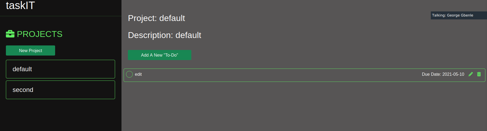

# taskIT

## Project Description
- This is an application for task and time management. It utilizes a simple user interface where a users can create projects and add tasks or "to-dos" to specific projects. 

- Creating a project is as simple as filling out the new project form with the project's title and description. The project panel is enabled for editing and deleting projects as well. Each task has functionalities for adding due date, editing, and deleting specific tasks.



## Live version

## Built With
- Javascript.
- HTML.
- CSS.

## Getting Started

To get a local copy up and running follow these simple example steps.

- Go to the "Code" section of this repository and press the green button that says "Code". Copy the URL or the SSH key.
- Go to the terminal and enter:
```
git clone URL/SSH key
```

The URL or SSH were the links copied from the step above.

- If you don't have git installed, you can download this project and unzip it.
- Change directory into the folder the application is saved.
- Launch the application from index.html.


## Usage
- Click the button:
```
New Project
```
- Fill in the title and description of your project.
- Click the button:
```
Add Project
```
- Your project title would be displayed in the same panel, double click it to display the project title and description in the right panel and start adding tasks to the project.
- Click the button:
```
Add New "To-Do"
```
- Fill in the description of the task, due date and set the priority for the task.
- Click the button:
```
Create Task
```
- Repeat the process to create task for as many tasks as you have to complete a project.
- Click the check box in front of each task description in order to mark a task completed.


## Author


👤 **George Gbenle**

- GitHub: [george-shammar](https://github.com/george-shammar)
- Twitter: [@GeorgeShammar](https://twitter.com/GeorgeShammar)
- LinkedIn: [George Gbenle](https://www.linkedin.com/in/georgegbenle/)
 
👤 **Widzmarc Jean Nesly Phelle**
- Instagram: [widzthedvloper](https://www.instagram.com/widzthedvloper/)
- LInkedin: [widzthedvloper](https://www.linkedin.com/in/widzmarc-jean-nesly-phelle-252a26129/)
- Github: [widzthedvloper](https://github.com/widzthedvloper)


## 🤝 Contributing

Contributions, issues and feature requests are welcome!


## Show your support

Give a ⭐️ if you like this project!


## 📝 License

This project is [MIT](LICENSE) licensed.

## Acknowledgments